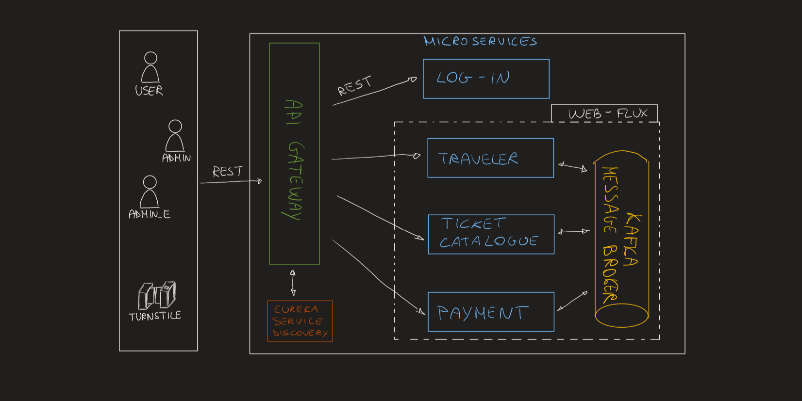
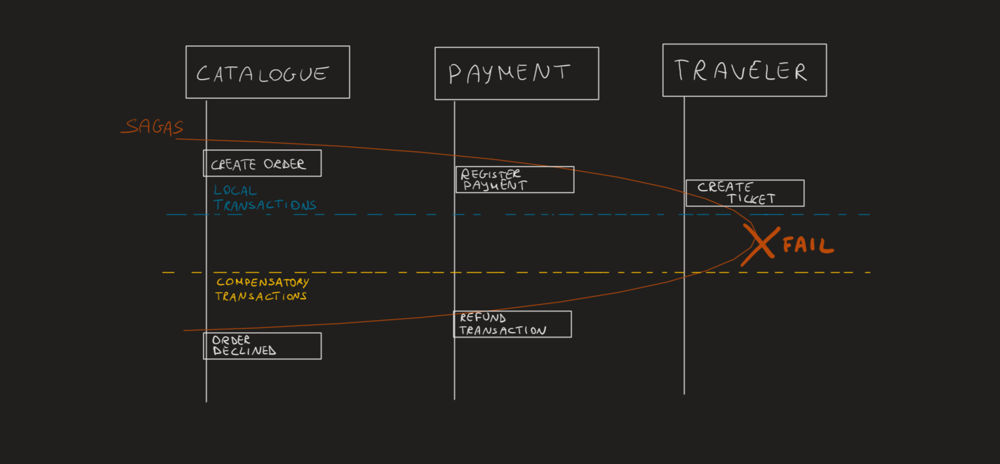

# Group04-FinalProject - Public Transport Company

## Index:

### -  [Microservice architecture](#Microservice architecture)

### - [Business Logic](#business-logic)

### - [Set-up project guidelines](#set-up-project-guidelines)

------------------------------------------------------

# Microservice architecture

TODO: update with the new architecture idea (API Gateway, etc.)



## Scalability & Availability

### Kafka
### Saga
Involved transaction



TODO: explation of why a sort of Saga Choreography

### Eureka Server
### API Gateway


---------------------------------------------------
## Business Logic

## User types
TODO: LIST: human users, travelers and administrators, as well as a
set of embedded systems
## TODO: read below, do more readable and short this part and use a suitable title

NOTE: before to shop tickets, be sure to have injected inside the User Details table the specific user record (and
eventually the date of birth, if the purchased ticket has age restriction)

During purchasing, the Catalogue service is responsible only to manage orders and sales, retrieve info from Traveler
service, check validity of information (age constraints, duration, etc)
and only if payment has been accepted (after contacting Payment service), contact the traveler service which is the one
in charge of generating tickets using the speicific informations.

Payment service "contact" the bank service to check the payment simply by generating a random number : if it is even,
payment is denied, if instead is odd it will be accepted.
Tickets are generated only if payment succeed.

Tickets was thought as follow :

- each ticket has a price, a type (that can only be "ordinal" or "seasonal"), a name (that must be unique and represent
  uniquely the ticket), min and max age for pucrhasing that ticket (these fields are optional), and duration (which is
  available only for "seasonal" types).
  duration is expressed in minutes (so that admin can add tickets which have a more flexible duration : a certain number
  of minutes, hours, days or months)

- ordinal tickets are already inside the Database once you run the catalogue service, and new ones cannot be inserted by
  an admin.
  An admin can add only seasonal tickets, using a JSON as follows :

```json
  {
  "price": 2.35,
  "type": "seasonal",
  "name": "mia prova3",
  "minAge": 2,
  "maxAge": 14,
  "duration": 65
}
```

- When a user want to buy a ticket, has to send to the shop endpoint the following JSON : <br>

```json
 {
  "quantity": 1,
  "ticketId": 2,
  "zoneId": "a",
  "notBefore": "24-07-2022",
  "creditCardNumber": "542523343010990",
  "expirationDate": "03-06-2023",
  "cvv": "333",
  "cardHolder": "David Enzo Dongiomicco",
  "duration": 30
}
  ````

- if the purchased ticket is an ordinal one, duration is neither necessary nor useful; instead, for seasonal ones it is
  required.

- The only expected "ordinal" ticket to shop are :

1) "70 minutes" -> validFrom = instant in which is purchased/generated , exp = 70 minutes after (the notBefore field
   here is required but is useless to generate the ticket)
2) "daily" -> It last 24 hours, for a specific day specified inside the JSON notBefore field (validFrom = midnight of
   the day specified in the notBefore field, exp : midnight of the day after)
3) "weekly" -> It last 7 days, from monday to sunday of any specified week. In order to select the specific week,
   notBefore field MUST be the Monday of the specific selected Week. "Weekly" tickets must start on "monday" days of the
   week.


4) "monthly" -> Valid only from the first day of a selected month, up to the last day of that month. Is possible to
   select the specific month by using the notBefore field of the JSON in the POST request
   : for this reason, notBefore must be the first day of the specific month selected. A monthly ticket cannot start from
   a day which is not the 1st day of that month.

5) "biannually" -> Valid only from the first day of a selected month, up to the last day of the 6th month.Is possible to
   select the specific starting month by using the notBefore field of the JSON in the POST request
   : for this reason, notBefore must be the first day of the specific month selected. A biannual ticket cannot start
   from a day which is not the 1st day of that month.


6) "yearly" -> Valid only from the first day of a selected month, up to the last day of the 12th month.Is possible to
   select the specific starting month by using the notBefore field of the JSON in the POST request
   : for this reason, notBefore must be the first day of the specific month selected. A yearly ticket cannot start from
   a day which is not the 1st day of that month.

7) "weekend_pass" -> valid only for a specific weekend (both saturday and sunday) . Is possible to select the specific
   weekend by using the notBefore field of the JSON in the POST request
   : for this reason, notBefore must be a saturday or a sunday of the specific selected weekend. In weekend pass ticket,
   notBefore cannot be any day of a specific year, but only a saturday or a sunday.


- when a user purchase a ticket inserted by an admin (a seasonal one), the generated ticket is valid from the current
  time (nbf=iat) until the specified minutes added to the current time (exp = iat + duration = nbf + duration)

## Requests
TODO: list here requests as in the previous year final project


------------------------------------------------------

# Set-up project guidelines

The following guidelines illustrate how to set up the project concretely:

- [Set up Kafka](#kafka-containers)
- [Set up Databases](#databases)
- [Set up Servers](#servers)

## Kafka containers

Run in the project command line:

`docker-compose up -d`

Once completed,<br>
**start** the two created containers (_kafka_kafka_1_ and _kafka_zookeeper_1_)

`docker start group04_final_project_kafka_1 group04_final_project_zookeeper_1`

## Databases

**Two** containers are necessary, each one with 2 databases respectively.

### 1. Create containers

For creating these two containers, <br>
execute the following command in the command line:

`docker run --name login_traveler_container -p 54320:5432 -e POSTGRES_PASSWORD=postgres -e POSTGRES_DB=db_traveler -d postgres`

and then

`docker run --name ticketCatalogue_payment_container -p 54321:5432 -e POSTGRES_PASSWORD=postgres -e POSTGRES_DB=db_payment -d postgres`

These four databases have the following names respectively: <br>

- Container _**login_traveler_container**_ has the following two databases:
    * _postgres_, on port 54320, that contains info regarding **_login service_**
    * _db_traveler_, on port 54320, that contains info regarding **_traveler service_**

- Container _**ticketCatalogue_payment_container**_ has the following two databases:
    * _postgres_, on port 54321, that contains info regarding **_ticket catalogue service_**
    * _db_payment_, on port 54321, that contains info regarding **_payment service_**

### 2. Start containers

**Start** the created containers with the following command:

`docker start login_traveler_container ticketCatalogue_payment_container`

### 3. Add Datasources

**In addition**, to successfully run the app,<br>
Add two new Datasources of type PostegreSQL in the IntelliJ project, <br>
for each one username and password (should be _postgres_ and _postgres_ respectively) specified in:

- [application-credentials.properties](login_service/src/main/resources/application-credentials.properties)
    - fields: _spring.datasource.username_ and _spring.datasource.password_
- [application.properties](ticket_catalogue_service/src/main/resources/application.properties)
    - fields: _spring.r2dbc.username_ and _spring.r2dbc.password_

and the host and port specified in

- _spring.datasource.url_ of the [application.properties](login_service/src/main/resources/application.properties) (
  should be _localhost_ and _54320_)
- _spring.r2dbc.url_ of
  the [application.properties](ticket_catalogue_service/src/main/resources/application.properties) (should be _
  localhost_ and _54321_)

## Servers

* **_LoginService_** server (DB: _postgres_  on port 54320) on port 8081
* **_TravelerService_** server (DB: _db_traveler_ on port 54320) on port 8085

* **_TicketCatalogueService_** server (DB: _postgres_  on port 54321) on port 8082
* **_PaymentService_** server (DB: _db_payment_ on port 54321) on port 8083
* **_EurekaService_** server on port 8761
* **_GatewayService_** server on port 8761

------------------------------------
