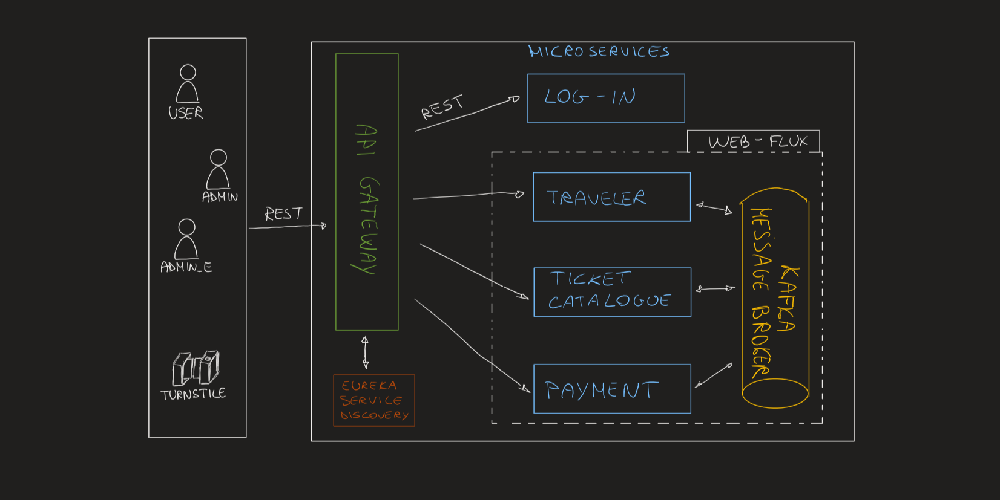

# Group04-FinalProject - Public Transport Company

## Index:

### -  [Microservice architecture](#Microservice architecture)

### - [Business Logic](#business-logic)

### - [Set-up project guidelines](#set-up-project-guidelines)

------------------------------------------------------

# Microservice architecture

## Scalability & Availability

### - Kafka
### - Saga Choreography
Involved transaction: purchasing tickets

### - Eureka Server
### - API Gateway

---------------------------------------------------
## Business Logic

### User types
1) Admin
2) Admin_E
3) User
4) Turnstile/Embedded_system

### Ticket types

### Requests

------------------------------------------------------

# Set-up project guidelines

The following guidelines illustrate how to set up the project concretely:

- [Set up Kafka](#kafka-containers)
- [Set up Databases](#databases)
- [Set up Servers](#servers)

## Kafka containers

Run in the project command line:

`docker-compose up -d`

Once completed, 
**start** the two created containers (_kafka_kafka_1_ and _kafka_zookeeper_1_)

`docker start group04_final_project_kafka_1 group04_final_project_zookeeper_1`

## Databases

**Two** containers are necessary, each one with 2 databases respectively.

### 1. Create containers

For creating these two containers,  
execute the following command in the command line:

`docker run --name login_traveler_container -p 54320:5432 -e POSTGRES_PASSWORD=postgres -e POSTGRES_DB=db_traveler -d postgres`

and then

`docker run --name ticketCatalogue_payment_container -p 54321:5432 -e POSTGRES_PASSWORD=postgres -e POSTGRES_DB=db_payment -d postgres`

These four databases have the following names respectively:  

- Container _**login_traveler_container**_ has the following two databases:
    * _postgres_, on port 54320, that contains info regarding **_login service_**
    * _db_traveler_, on port 54320, that contains info regarding **_traveler service_**

- Container _**ticketCatalogue_payment_container**_ has the following two databases:
    * _postgres_, on port 54321, that contains info regarding **_ticket catalogue service_**
    * _db_payment_, on port 54321, that contains info regarding **_payment service_**

### 2. Start containers

**Start** the created containers with the following command:

`docker start login_traveler_container ticketCatalogue_payment_container`

### 3. Add Datasources

**In addition**, to successfully run the app, 
Add two new Datasources of type PostegreSQL in the IntelliJ project,  
for each one username and password (should be _postgres_ and _postgres_ respectively) specified in:

- [application-credentials.properties](login_service/src/main/resources/application-credentials.properties)
    - fields: _spring.datasource.username_ and _spring.datasource.password_
- [application.properties](ticket_catalogue_service/src/main/resources/application.properties)
    - fields: _spring.r2dbc.username_ and _spring.r2dbc.password_

and the host and port specified in

- _spring.datasource.url_ of the [application.properties](login_service/src/main/resources/application.properties) (
  should be _localhost_ and _54320_)
- _spring.r2dbc.url_ of
  the [application.properties](ticket_catalogue_service/src/main/resources/application.properties) (should be _
  localhost_ and _54321_)

## Servers

* **_LoginService_** server (DB: _postgres_  on port 54320) on port 8081
* **_TravelerService_** server (DB: _db_traveler_ on port 54320) on port 8085

* **_TicketCatalogueService_** server (DB: _postgres_  on port 54321) on port 8082
* **_PaymentService_** server (DB: _db_payment_ on port 54321) on port 8083
* **_EurekaService_** server on port 8761
* **_GatewayService_** server on port 8761

------------------------------------
